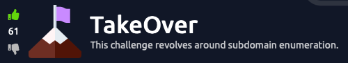

<h1>writeup-TakeOver</h1>

<ol>
    Important points.
    <li>This room is about subdomain enumeration.</li>
    <li>Add <code>futurevera.thm</code> in <code>/etc/hosts</code></li>
</ol>
<strong>I am including all the steps i took to solve this machine weather is was fruitful or not.</strong>

<h3>Check the web page.</h3>
<ul>
    <strong>What i noticed :-</strong> 
    <li>Getting ssl error.</li>
    <li>No intresting directory</li>
    <li>Nothing intresting in the source code.</li>
    <li>Nothing in <code>.js</code> file.</li>
    <li>Nothing in <code> Certificate </code></li>
</ul>

<h3>Fuzzing for subdomain using ffuf.</h3>
<code>ffuf -u http://{MachineIp}/ -w /usr/share/seclists/Discovery/Web-Content/raft-medium-words.txt -H 'Host: FUZZ.futurevera.thm' -fs {size}</code>
<ul>
    <li>This command gave me two subdomains and both of them had a message on the screen saying <code>{subdomain}.futurevera.thm is only availiable via internal VPN</code>
    <li>Got nothing important while enumerating directories or files.</li>
</ul>
</code>

After wasting some time by using different wordlists to fuzz the subdomain, i tried the same ffuf command but with <code>https</code> this time and it gave me two new subdomains this time.

<h3>Enumerating new subdomains</h3>
<ul>
    <li>Nothing in directory enumeration.</li>
    <li>Nothing important in source code as well.</li>
    <li>But this time, there is something in <code>view certificate</code>.</li>
</ul>
<h3>Flag</h3>

Take a look at the certificates for both the subdomains and you will see one more subdomain in the  <code>Subject Alt Names</code>

If you don't know how to do this. (For firefox)

<ol>
    <li>Click on the lock icon in the search bar with a warning sign.</li>
    <li>Click on <code>Connection not scure</code></li>
    <li>Click on <code>More Information</code></li>
    <li>Click on <code>View Certificate</code></li>
</ol>

Add this new found subdomain in your <code>/etc/hosts</code>

<code>curl --head {subdomain}.futurevera.thm</code> and your flag will be in <code>Locatiion:</code>

<h2>Done 😁</h2>